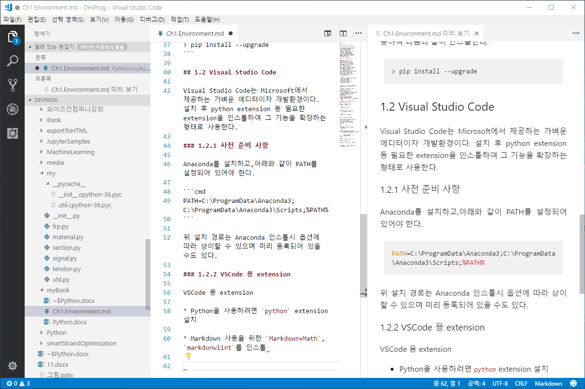
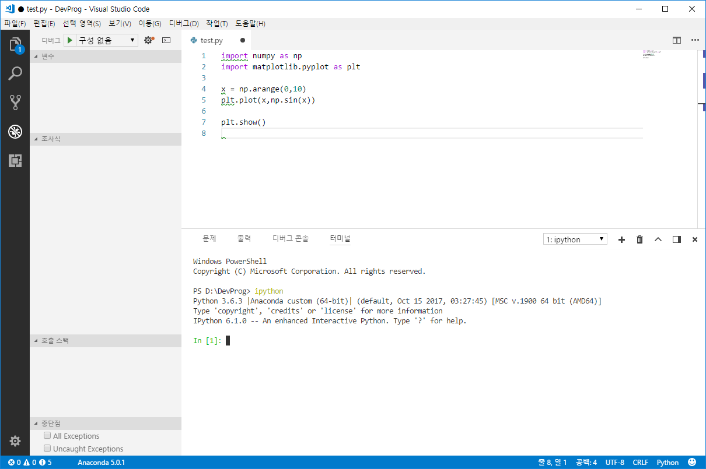

# 1. 환경구축

## 1.1 환경 구성

### 1.1.1 Python 배포본과 Anaconda

Python은 [www.python.org](https://www.python.org)에서 관리하며 표준 배포본을 제공하고 있다. 실제 Python 사용시 필요한 다양한 패키지를 일일이 인스톨하는 것이 쉽지 않다. 그렇기 때문에 대부분 Anaconda, Canopi 등과 같은 배포본이 많이 사용되고 있다. 여기에서 Anaconda를 사용하기로 한다. Anaconda에는 NumPy, matplotlib 등 필수 패키지가 포함하고 있으며 통합개발환경인 Spyder,Jupyter 등을 같이 제공하기 때문에 사용하기 편리하다.

### 1.1.2 추가 Python 패키지

Anaconda에는 대부분 많이 사용하는 패지지가 포함되어 있다. 이외의 패키지를 깔기 위해서는 가능한 pip나 conda 등의 패키지 관리자를 지원하는 것을 찾는 것이 좋다. 원래 python은 setup.py를 통해 패키지 인스톨이 가능하지만 순수 파이썬 파일이외에 DLL 등을 포함할 경우 인스톨이 쉽지 않다. 이를 이를 보완하기 위해 출현한 것이 Python 표준의 pip이다. conda는 Anaconda에서 사용하는 pip 정도로 이해하면 된다. 이 문서에서는 Anaconda 배포본에 미리 포함되지 않은 다양한 패키지의 인스톨이 필요하다. Anaconda 명령창(Anaconda Prompt)을 관리자 권한으로 연 후 다음과 같이 pip로 인스톨한다. conda 대신 pip를 사용하는 이유는Tensorflow와 같이 일부 패키지에서는 공식적으로 pip만 지원하기 때문이다

```cmd
> pip install opencv-contrib-python
> pip install pygame
> pip install graphviz
> pip install pydot
> pip install theano
> pip install tensorflow
> pip install keras
```

* `opencv-contrib-python`은 OpenCV와 OpenCV contrib 모듈을 포함한 패키지이다.

* `pygame`은 비디오 게임을 작성하는데 필요한 모듈이다. 

* `graphviz`와 `pydot`은 다이어그램을 그리기위한 파이썬 패키지이지만 실제 실행파일을 포함하고 있지 않다. 정상작동을 위해서는 [www.grpahviz.org](http://www.graphviz.org/)에서 설치파일(현 버전은 graphviz-2.38.msi)을 다운로드 후 graphviz를 설치하고 환경변수를 설정해야 한다. 자세한 사항은 [Keras_Install_on_Windows](https://tykimos.github.io/2017/08/07/Keras_Install_on_Windows/)을 참고한다.

* `theano`, `tensorflow`, `keras`는 Machine Learning 패키지이다.

만약 인스톨이 안되면 다음과 같이 pip를 conda로 새로 깔고 시도한다.

```cmd
> conda install pip
```

업그레이드 시에서는 다음과 같이 --upgrade 옵션을 사용하여 다음과 같이 인스톨한다.

```cmd
> pip install --upgrade opencv-contrib-python
```

## 1.2 Visual Studio Code

Visual Studio Code는 Microsoft에서 제공하는 가벼운 에디터이자 개발환경이다. 설치 후 python extension 등 필요한 extension을 인스톨하여 그 기능을 확장하는 형태로 사용한다.

### 1.2.1 사전 준비 사항

Anaconda를 설치하고,아래와 같이 PATH를 설정되어 있어야 한다.

```cmd
PATH=C:\ProgramData\Anaconda3;C:\ProgramData\Anaconda3\Scripts;%PATH%
```

위 설치 경로는 Anaconda 인스톨시 옵션에 따라 상이할 수 있으며 미리 등록되어 있을 수도 있다.

### 1.2.2 VSCode 용 extension

VSCode 용 extension

* Python을 사용하려면 `python` extension 설치

* Markdown 사용을 위한 `Markdown+Math`, `markdonwlint`를 인스톨


*Visual Studio Code를 이용한 Markdown 에디팅 모습*


*Visual Studio Code를 이용한 Python 개발*


