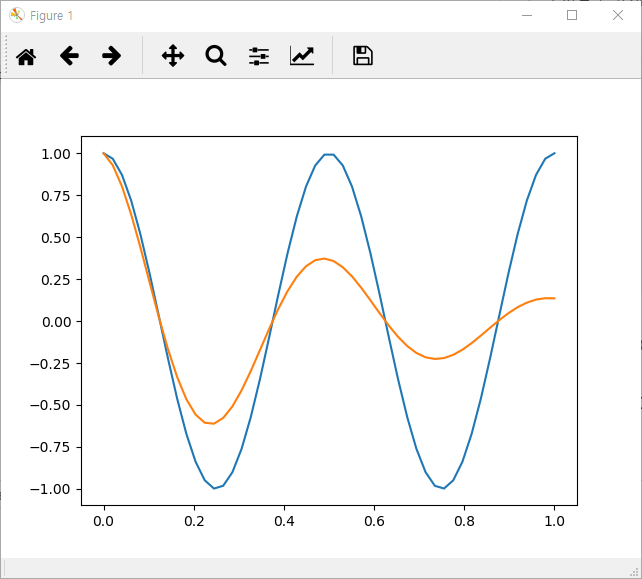
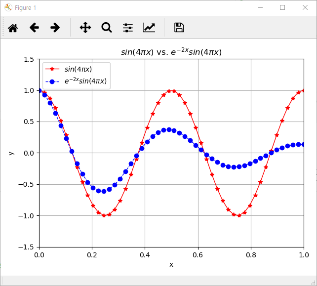
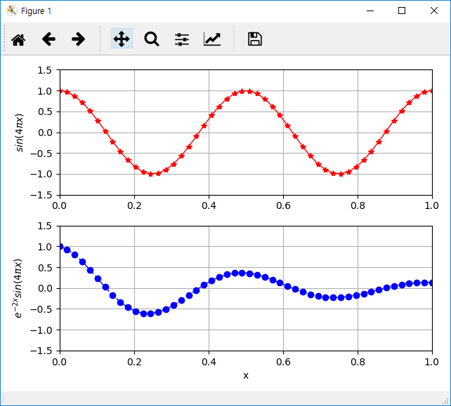
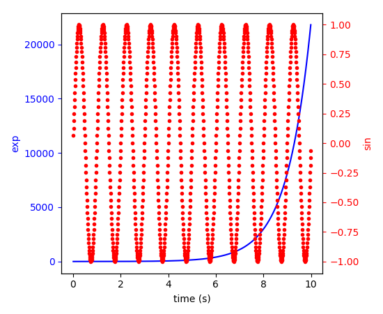
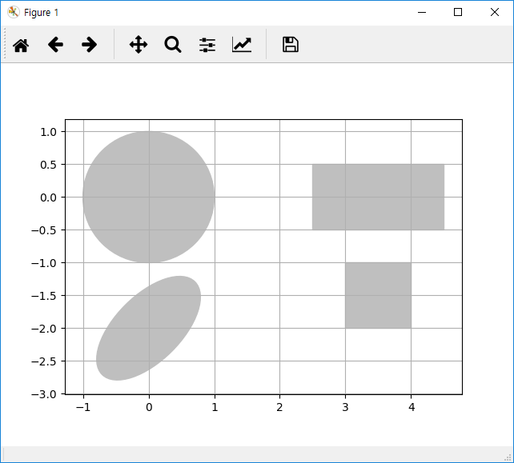

# Chapter 4. Matplotlib

## 4.1 들어가기

인터랙티브하게 사용하기
```python
>>> matplotlib.pyplot.ion()
>>> matplotlib.pyplot.ioff()
```


### 4.1.1 간단한 2차원 플롯

matplotlib은 2차원 그래픽 패키지이다. Matlab과 같이 커맨드 방식으로 그래프를 그릴 수 있으며, 커맨드 함수의 이름도 유사도록 설계되어 있다. 다음은 간단한 예이다.

```python
# example 1
import matplotlib.pyplot as plt
import numpy as np

x = np.linspace(0,1,50)

y1 = np.cos(4*np.pi*x)
y2 = np.cos(4*np.pi*x)*np.exp(-2*x)

plt.plot(x,y1)
plt.plot(x,y2)

plt.show()
```

* `plt.plot(x,y)`로 이차원 선그래프를 그릴 수 있다. 

* `plt.show()`는 화면에 표시하는 기능을 하는데 Jupyter나 IPython을 사용할 때는 자동으로 표시되기 때문에 호출할 필요가 없다. 

### 4.1.2 꾸미기

다음은 같은 그래프에 대해 보다 보기좋게 나타낸 것이다. 

```python
# example 2
import matplotlib.pyplot as plt
import numpy as np

x = np.linspace(0,1,50)

y1 = np.cos(4*np.pi*x)
y2 = np.cos(4*np.pi*x)*np.exp(-2*x)

plt.plot(x,y1,'r-*', 
         label=r'$sin(4 \pi x)$',lw=1)
plt.plot(x,y2,'b--o',
   label=r'$ e^{-2x} sin(4\pi x) $',lw=1)
plt.title(r'$sin(4 \pi x)$ vs. $ e^{-2x} sin(4\pi x)$')
plt.xlabel('x')
plt.ylabel('y')
plt.axis([0,1,-1.5,1.5])
plt.grid(True)
plt.legend(loc='upper left')
plt.tight_layout()
plt.show()
```

* `plt.plot(x,y,'r-*',label='sin',lw=1)`에서 `'r-*'`은 문자열은 색상, 선타입, 마커 등의 속성을 나타낸다. `'r-*'`는 red, solid line, * 마커를 의미한다. `label`은 레전드에 표시될 내용이고, `lw`는 line width이다.

* `plt.title(title)`, `plt.xlabel(xlabel)`, `plt.ylabel(ylabel)`은 제목, X와 Y축 제목을 나타낸다.

* `plt.axis([xmin,xmax,ymin,ymax])`는 축의 범위를 지정한다. 

* `plt.xlim([xmin, xmax])`, `plt.ylim([ymin, ymax])`을 사용할 수도 있다. 

* `plt.grid(True)`는 격자를 그리고, plt.legend()는 레전드를 표시한다. 

* `plt.tight_layout()`은 여백을 조정하는 역할을 한다. 

* `latex` 수식을 `title()`, `xlabel()`, `ylabel()`, `text()` 등에 지정할 수 있다. 다만 r’text’ 등과 같은 r을 앞에 기입하여 raw 문자열이어야 한다.

Example 1  | Example 2
-----------|---------
  | 


### 4.1.3 주로 사용하는 선과 마커

다음은 선의 색상 및 스타일, 마커 등의 옵션이다. 


### 4.1.4 Subplot

Subplot은 Matlab처럼 `plt.subplot(nrow,ncol,inum)`을 호출하는 것으로 그릴 수 있다. 

```python
import matplotlib.pyplot as plt
import numpy as np

x = np.linspace(0,1,50)

y1 = np.cos(4*np.pi*x)
y2 = np.cos(4*np.pi*x)*np.exp(-2*x)

plt.subplot(2,1,1)
plt.plot(x,y1,'r-*',lw=1)
plt.grid(True)
plt.ylabel(r'$sin(4 \pi x)$')
plt.axis([0,1,-1.5,1.5])


plt.subplot(2,1,2)
plt.plot(x,y2,'b--o',lw=1)
plt.grid(True)
plt.xlabel('x')
plt.ylabel(r'$ e^{-2x} sin(4\pi x) $')
plt.axis([0,1,-1.5,1.5]) 

plt.tight_layout() 
plt.show()
```




### 4.4.5 주요 함수 요약

* `plot()`
* `subplot()`
* `title()`
* `xlabel()`
* `ylabel()`
* `axis()`
* `xlim()`
* `ylim()`
* `tight_layout()`
* `grid()`
* `legend()`
* `show()`
* `figure()`
* `text()`
* `subplots()`

## 4.2 Matplotlib의 이해

### 4.2.1 Matplotlib의 구동 방식

이전 절에 설명한 것은 Matlab과 같이 커맨드 방식으로 그래픽을 나타낸 것으로 matplotlib.pyplot 모듈에 함수로 정의되어 있다. 실제로 matplotlib은 객체지향라이브러리리로, 보다 보기 좋은 그래프를 만들기 위해서는 그 내부 구조를 이해할 필요가 있다.

matplotlib API에는 `FigureCanvas`, `Renderer`, `Artist`라는 세가지 객체로 구성되어 있다. 

* `FigureCanvas`: 그림을 그릴 영역을 나타내는 객체

*	`Renderer`: 캔버스(`FigureCanvas`)에 그리는 도구 객체

*	`Artist` : `Renderer`가 `FigureCanvas`에 어떻게 그릴 것인가를 나타내는 객체

`FigureCanvas`와 `Renderer`는 wxPython, PostScript 등과 같은 사용자이터페이스 툴킷과 연계되는 낮은 수준의 제어를 담당하며, `Artist`는 figure, text, line, patch 등을 표시하는 높은 수준을 담당하게 된다(patch는 rectange, spline, path 등을 모두 이르는 용어). 따라서 matplotlib 사용자 입장에서는 Artist 객체를 다루는데 집중하면 된다. `Artist`는 primitives와 containers라는 두가지 유형으로 구분할 수 있다.

* Primitives: `Line2D`, `Rectangle`, `Text`, `AxesImage`, `Patch` 등과 같이 캔버스에 그려지는 표준 그래픽 객체

* Containers: `Axis`, `Axes`, `Figure` 등과 같이 이들 primitives가 위치하게 될 대상

커맨드 방식이 아닌 객체지향 방식으로 그림을 그리는 표준적인 방법은 `Figure` 객체를 생성하고, 이를 이용해 하나 이상의 `Axes` 객체를 만들고, `Axes` 객체의 헬퍼함수로 primitives를 만들어 내는 것이다.

다음 코드는 동일한 기능을 수행하는 것을 비교한 것이다. 

* **Method 1** : 커맨드 방식의 함수를 호출한 형태

```python
import matplotlib.pyplot as plt
import numpy as np

x = np.linspace(0,1,50)
y1 = np.cos(4*np.pi*x)
y2 = np.cos(4*np.pi*x)*np.exp(-2*x)

plt.plot(x,y1,'r-*',lw=1)
plt.plot(x,y2,'b--',lw=1)	
```

* **Method 2** :객체지향 방식으로 그래프를 그린 것이다.

```python
import matplotlib.pyplot as plt
import numpy as np

x = np.linspace(0,1,50)
y1 = np.cos(4*np.pi*x)
y2 = np.cos(4*np.pi*x)*np.exp(-2*x)

fig = plt.figure()
ax = fig.add_axes([0.15,0.1,0.8,0.8)
ax.plot(x,y1,'r-*',lw=1)
ax.plot(x,y2,'b--',lw=1)
```

* **Method 3** :이 둘을 조합하여 `Figure`와 `Axes`를 `plt.subpolots()`라는 편의 함수를 사용한 것이다. 

```python
import matplotlib.pyplot as plt
import numpy as np

x = np.linspace(0,1,50)
y1 = np.cos(4*np.pi*x)
y2 = np.cos(4*np.pi*x)*np.exp(-2*x)

fig,ax = plt.subplots()
ax.plot(x,y1,'r-*',lw=1)
ax.plot(x,y2,'b--',lw=1)
```

사실 `plt.plot(x,y,…)` 커맨드 함수는 `Line2D`라는 `Axes` 에 포함되는 primitive를 현재의 `Axes`를 대상으로 만들어 주는 함수이다. 만약 `Figure`, `Axes` 객체가 없다면 이를 만들어 준다. 따라서 (2)와 같은 방식이 matplotlib의 내부의 구동 상황을 잘 표현한다고 할 수 있다. 마지막 예인 (3)에서 `plt.subplots()`는 `Figure` 객체와 `Axes` 객체를 동시에 리턴한다. 또한 `plt.subplots(2,1)` 등과 같이 호출한면 2*1 subplot에 대응하는 `Figure` 객체와 `Axes` 객체의 리스트를 리턴하여 주기 때문에 편리하다. 많은 쓰는 함수로 `gca()`가 있는 현재의 `Axes` 객체를 구해준다.

### 4.2.2 Axes와 Axis

Artist 객체에서 Figure, Axes, Axis의 개념이 중심한데 다음은 이를 나타낸 것이다. Axes와 Axis를 구분하는 것이 중요하다.


### 4.2.3 Subplot을 그리는 방식

다음 코드는 subplot을 그린 예이다. 왼쪽의 기존 방식과 비교할 때 `subplots()`로 `Figure` 객체와 `Axes` 객체 리스트를 만들고, Axes 객체를 대상으로 `plot()`, `grid()`, `set_xlabel()` 등의 메쏘드를 호출하였다. 메쏘드 이름에서 일부 차이나는 것을 제외하면 두 방식이 매우 유사함을 알 수 있다. 

* **Method 1** : `subplot()`을 이용하는 방법

```python
import matplotlib.pyplot as plt
import numpy as np

x = np.linspace(0,1,50)

y1 = np.cos(4*np.pi*x)
y2 = np.cos(4*np.pi*x)*np.exp(-2*x)

plt.subplot(2,1,1)
plt.plot(x,y1,'r-*',lw=1)
plt.grid(True)  
plt.ylabel(r'$sin(4 \pi x)$')
plt.axis([0,1,-1.5,1.5])

plt.subplot(2,1,2)
plt.plot(x,y2,'b--o',lw=1)
plt.grid(True)
plt.xlabel('x')
plt.ylabel(r'$ e^{-2x} sin(4\pi x) $')
plt.axis([0,1,-1.5,1.5])

plt.tight_layout()
plt.show()
```

* **Method 2** : 'subplots()`를 이용하는 방법

```python
import matplotlib.pyplot as plt
import numpy as np

x = np.linspace(0,1,50)

y1 = np.cos(4*np.pi*x)
y2 = np.cos(4*np.pi*x)*np.exp(-2*x)

fig,ax = plt.subplots(2,1)

ax[0].plot(x,y1,'r-*',lw=1)
ax[0].grid(True)
ax[0].set_ylabel(r'$sin(4 \pi x)$')
ax[0].axis([0,1,-1.5,1.5])

ax[1].plot(x,y2,'b--o',lw=1)
ax[1].grid(True)
ax[1].set_xlabel('x')
ax[1].set_ylabel(r'$ e^{-2x} sin(4\pi x) $')
ax[1].axis([0,1,-1.5,1.5])

plt.tight_layout()
plt.show()
```
### 4.2.4 getp()를 이용한 정보 알아내기

matplotlib 객체에 대한 정보는 plt.getp() 함수로 구할 수 있다. 

```python
>>> plt.getp(fig)
    agg_filter = None
    alpha = None
    animated = False
    axes = [<matplotlib.axes._subplots.AxesSubplot object at ...
    children = [<matplotlib.patches.Rectangle object at 0x0000013...
    clip_box = None
    clip_on = True
    ...
```

## 4.3 How-To

### 4.3.1 IPython 콘솔

IPython 콘솔에서 그래프가 출력되게 하도록 할 수도 있는데 다음과 같이 입력하면 된다. 

```python
>>> %matplotlib inline
```

다시 별도의 창으로 그래픽이 출력되게 하려면 다음과 같이 입력한다. 

```python
>>> %matplotlib qt5
```

위와 같이 IPython은 %로 시작하는 자체 명령어가 있는데 이를 magic command라고 한다. Spyder에서 이와 같은 제어가 되게 하려면 설정/IPython console/Graphics/Graphic backend 설정으로 디폴트인 inline 대신 Automatic으로 바꾸고 Spyder를 재기동 해야 한다. Visual Studio에서는 별도의 설정이 필요 없다.

### 4.3.2 `gca()`, `gcf()`와 `axis()`

`gca()`로 현재의 `Axes`를, `gcf()`로 현재의 `Figure` 객체를 구할 수 있다. 경우에 따라서 유용하게 사용된다. 이 두 함수는 만약 현재의 `Axes`나 `Figure`가 없을 경우 새로 생성한다.

```python
import matplotlib.pyplot as plt

plt.gca().plot([1,2,3])   # 이전 그림이 없으면 생성
plt.gca().plot([7,8,9])   #  현재 그림에 그림
```

`axis()`는 축과 관련된 편의 함수이다. 

* `axis()` : 축의 [xmin, xmax, ymin, ymax]를 리턴한다.

* `axis([xmin, xmax, ymin, ymax])` : 축의 범위를 지정한다. 
* `axis(‘off’)` : 축과 라벨을 없앤다. 
* `axis(‘equal’)`
* `axis(‘scaled’)`
* `axis(‘tight’)`
* `axis(‘image’)`
* `axis(‘auto’)`
* `axis(‘normal’)`
* `axis(‘square’)`

### 4.3.3 Figure 크기와 Face color

Figure의 크기를 조정하거나 face color를 조정하는 것은 다음과 같다. 

방법 1 : figure()로 생성할 때 인자로 조정하는 방법

```python
plt.figure(figsize=(10,5),facecolor=’yellow’)
```

방법 2: 이미 생성되는 있는 figure를 대상으로 멤버함수를 호출하는 방법

```python
# already constructed…. 
# for example : fig,ax = plt.subplots()   
# or fig = plt.gcf() 

fig.set_size_inches(10,5)
fig.patch.set_facecolor('white')
```
참고로 사용하는 환경에 따라 figure의 face color가 gray로 설정되는 경우가 있기 때문에 강재로 white로 지정하는 것이 보기 좋다. 

### 4.3.4 그림 저장하기

그림을 저장하기 위해서는 figure() 로 그림 객체를 만든후 savefig() 함수를 사용하면 된다. 

```python
>>> f = plt.figure();
… # plt.plot(...)
# ...
>>> f.savefig('AAA.png')

fig,ax = plt.subplots(2,2)  
        fig.set_size_inches(14,8)
        fig.set_facecolor('white')
```

### 4.3.5 종횡비와 축 없애기

Matplotlib을 일종의 캔버스로 사용하여 그림을 그릴 때는 가로세로 축, 프레임 등이 없어야 한다. 

```python
import matplotlib.pyplot as plt
import numpy as np

t = np.arange(0.0, 1.0 + 0.01, 0.01)
s = np.cos(2*2*np.pi*t)
plt.plot(t, s, '-', lw=2)

# aspect ratio
plt.axes().set_aspect('equal', 'datalim')

# axis 없애기
plt.axes().get_xaxis().set_visible(False)
plt.axes().get_yaxis().set_visible(False)

# frame 선 없애기
plt.axes().set_frame_on(False)

plt.tight_layout()
```

아래의 세 라인 대신 `plt.axes().axis('off')` 을 사용해도 된다. 

만약 축 라벨만 없애고 싶다면 `set_ticklabels([])`를 적용한다.

```python
import numpy as np
import matplotlib.pyplot as plt

theta = np.linspace(22,65,100)
h = theta*np.pi/180    # in radian


f2bzV = 1/( np.sin(h)* np.cos(h))/2
av = np.sin(h)/np.cos(h)

f = plt.figure()
plt.subplot(2,1,1)
plt.plot(theta,f2bzV)
plt.axis([22,65,0,2])
plt.ylabel(r'normalized $f_2$ for given $V$')
plt.gca().xaxis.set_ticklabels([])

plt.grid()

plt.subplot(2,1,2)
plt.plot(theta,1/f2bzV) # av)
plt.axis([22,65,0,2])
plt.ylabel(r'normalized $V$ for given $f_2$')
plt.xlabel(r'$\theta$')
plt.grid()

plt.tight_layout()

plt.savefig('compare.png')
```


### 4.3.6 두개의 Y 축

두개의 Y 축을 갖는 그래프는 Axes 객체를 x 축을 공유하도록 겹치면된다. 이때 사용되는 메쏘드가 Axes.twinx()이다. 

```python
import matplotlib.pyplot as plt

fig, ax1 = plt.subplots()
t = np.arange(0.01, 10.0, 0.01)
s1 = np.exp(t)
ax1.plot(t, s1, 'b-')
ax1.set_xlabel('time (s)')
# Make the y-axis label, ticks and tick labels match the line color.
ax1.set_ylabel('exp', color='b')
ax1.tick_params('y', colors='b')

ax2 = ax1.twinx()
s2 = np.sin(2 * np.pi * t)
ax2.plot(t, s2, 'r.')
ax2.set_ylabel('sin', color='r')
ax2.tick_params('y', colors='r')

fig.tight_layout()
plt.show()
```



### 4.3.7 다양한 도형 그리기

plot()  명령은 내부적으로 Line2D 객체를 생성하여 Axes 객체에 추가하게 된다. 비슷하게 다양한 도형 객체를 생성하여 Axes 객체에 추가하는 것으로 도형을 그릴 수 있다. 도형은 Patch 

```python
import matplotlib.pyplot as plt
import matplotlib.patches as patches
from matplotlib.path import Path


# circle
circle = patches.Circle((0,0),radius=1.,color = '.75')
plt.gca().add_patch(circle)

#rectangle
rect = patches.Rectangle((2.5, -.5), 2., 1., color = '.75')
plt.gca().add_patch(rect)

# Ellipse
ellipse = patches.Ellipse((0, -2.), 2., 1., angle = 45., color ='.75')
plt.gca().add_patch(ellipse)

# Path
verts = [
    (3., -2), # left, bottom
    (3., -1.), # left, top
    (4., -1.), # right, top
    (4., -2), # right, bottom
    (3., -2.), # ignored
    ]

codes = [Path.MOVETO,
         Path.LINETO,
         Path.LINETO,
         Path.LINETO,
         Path.CLOSEPOLY,
         ]

path = Path(verts, codes)

patch = patches.PathPatch(path, color='.75')  #  facecolor='orange', lw=2,
plt.gca().add_patch(patch)
plt.gca().set_xlim(-2,2)
plt.gca().set_ylim(-2,2)

plt.axis('scaled')
plt.grid(True)
plt.show()
```



### 4.3.8 Subplot 위치 및 크기 커스터마이징

[gridspec](https://matplotlib.org/users/gridspec.html)을 통해 가능하다.
